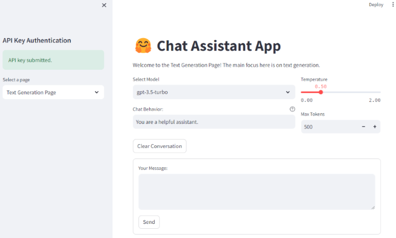
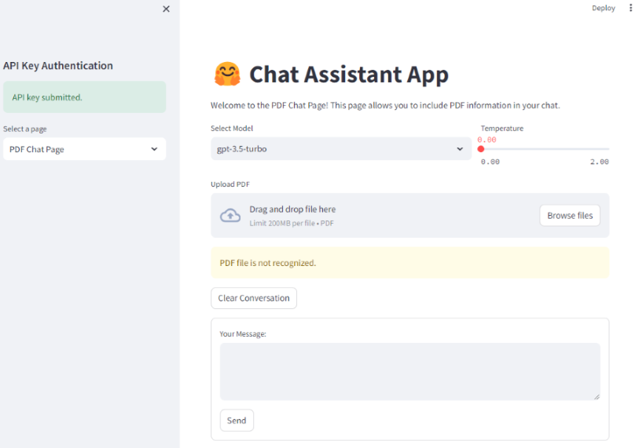

# Overview of the Chat Assistant App
The Chat Assistant App is a Python application designed to facilitate interactive text-based conversations with OpenAI's language models. This application allows users to engage in dynamic chats, perform text generation, and even integrate PDF information into the conversation.

## Features:

### Text Generation Page:

-	Users can generate text based on their input using OpenAI's language models.
-	Customizable options include model selection, chat behavior, temperature, and max tokens.

### PDF Chat Page:

-	Supports uploading PDF files for conversations. Utilizes Conversational Retrieval Chains to provide responses based on the content of uploaded PDFs.

### API Key Authentication:
-	Ensures secure communication with OpenAI by authenticating with the provided API key. Sets an OpenAI API key as environment variable.

### Token Tracking:
-	Monitors and displays the number of tokens used during the conversation.

### Clear Conversation:
-	Allows users to reset the chat history for a fresh interaction.
